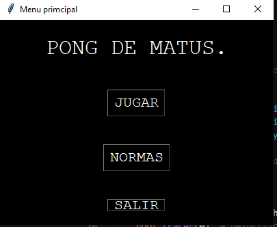
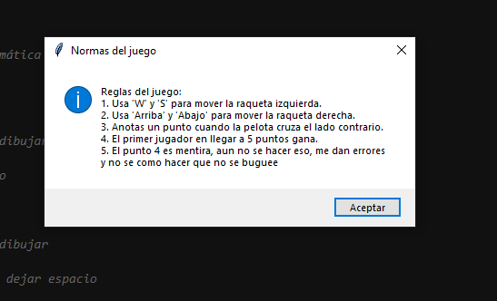
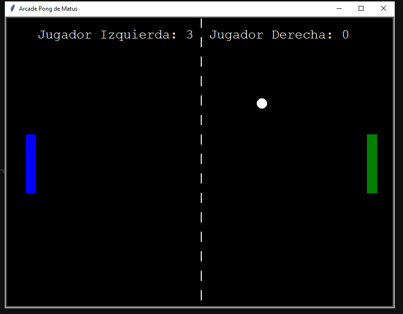

# 🕹️ Arcade Pong de Matus

Este es un pequeño juego estilo arcade del clásico **Pong**, programado en Python utilizando la librería `turtle`, `tkinter` para el menú y `pygame` para el sonido.

Incluye un menú principal, reglas del juego, sonidos personalizados y marcador en pantalla. Fue uno de mis primeros proyectos un poco más completos en Python.

> ⚠️ Aclaración: El punto de victoria aún no está bien implementado. El contador de puntos funciona, pero el final de partida da errores. Aun así, es una muestra clara de lo que sé hacer con Python.

---

## 📷 Capturas del juego

### 🖥️ Menú principal


### 📜 Normas


### 🎮 Juego en acción


---

## 🎮 Instrucciones del juego

- **Jugador Izquierdo:**  
  - W = subir  
  - S = bajar  
- **Jugador Derecho:**  
  - Flecha ↑ = subir  
  - Flecha ↓ = bajar  
- Ganas un punto cuando la pelota pasa al lado contrario.  
- El primero en llegar a 5 puntos **debería ganar**, pero aún no está implementado correctamente.

---

## 🧰 Tecnologías usadas

- Python 3
- `turtle` (gráficos)
- `tkinter` (interfaz gráfica)
- `pygame` (sonido)

---

## ▶️ Cómo ejecutarlo

1. Asegúrate de tener Python 3 instalado.
2. Instala `pygame` si no lo tienes:
   ```bash
   pip install pygame
